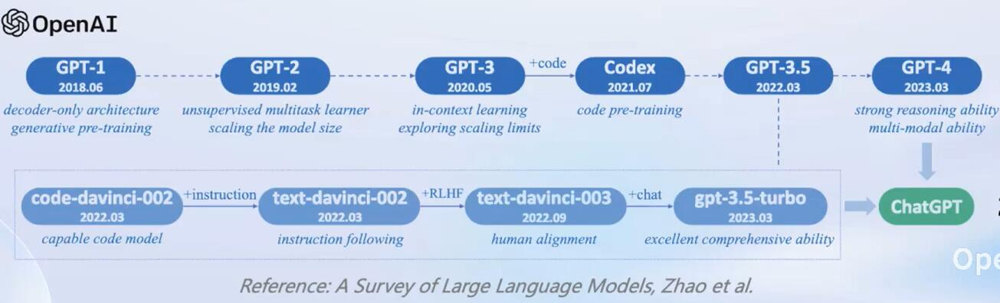
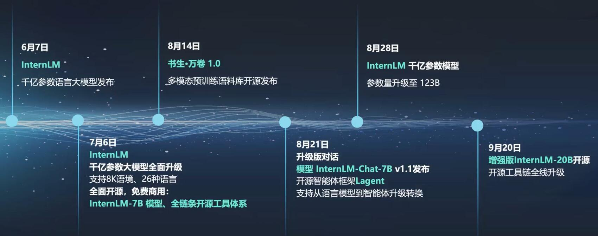
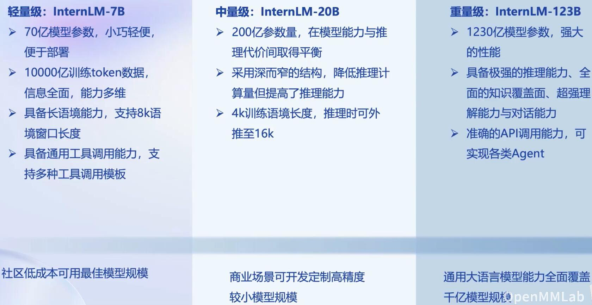
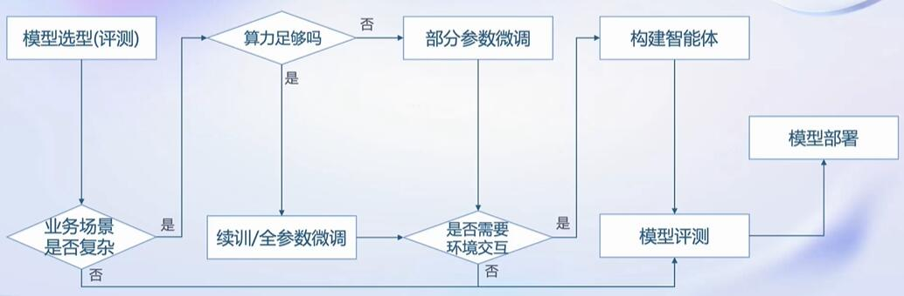
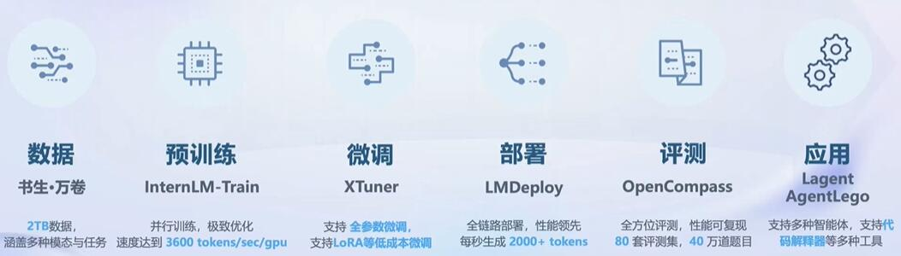

# 大模型

## ChatGPT的进化路线：

## 人工智能的发展趋势：
1. **专用模型**：针对特定任务，一个模型解决一个问题
2. **通用大模型**：一个模型应对多种任务、多种模态

## 书生·浦语大模型开源历程

- ### 书生·浦语大模型系列

- ### 应用方向：
   **智能客服、个人助手、行业应用**

- ### 从模型到应用：

## 书生·浦语全链条开放体系

