# 使用 InternLM-Chat-7B 模型生成 300 字的小故事

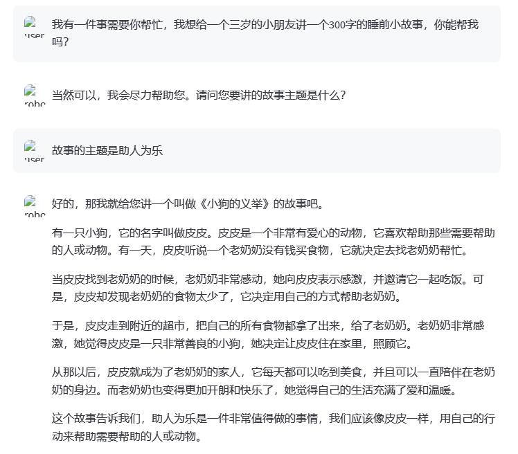

# 熟悉 hugging face 下载功能，使用 huggingface_hub python 包，下载 InternLM-20B 的 config.json 文件到本地（需截图下载过程）。
## 1. 首先更新huggingface_hub python 包
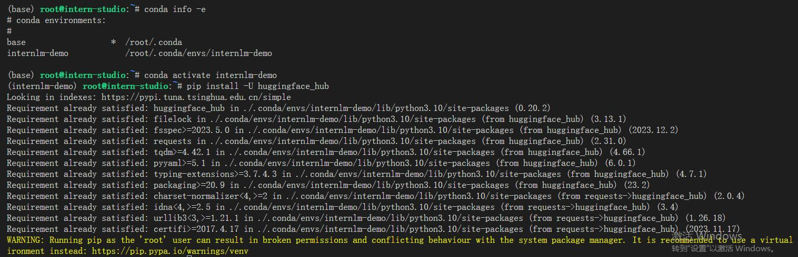
## 2. 创建py文件
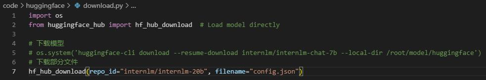
## 3. 运行后遇到报错，求助班级群

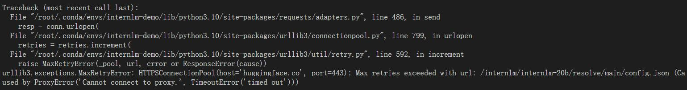
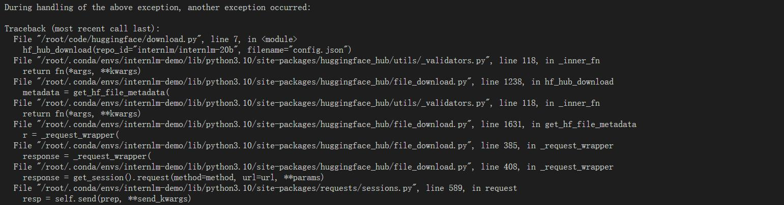
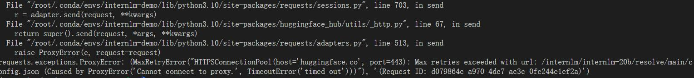
## 4. 找到解决办法
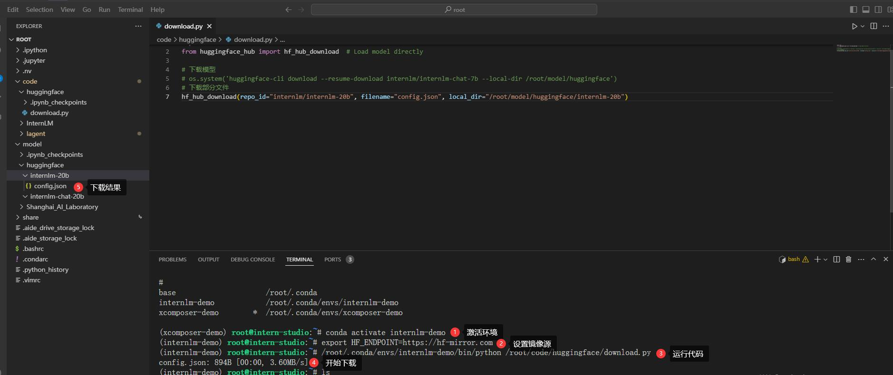

# 完成浦语·灵笔的图文理解及创作部署（需截图）
## 1. 遇到网页格式丢失的问题，通过Q&A文档中的知识进行了解决
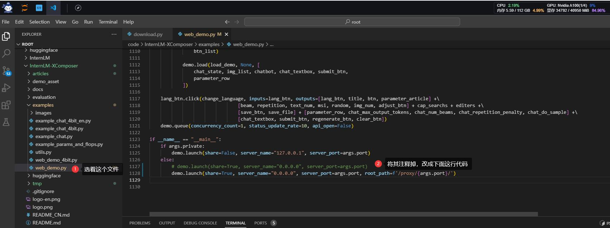
## 2. 图文并茂
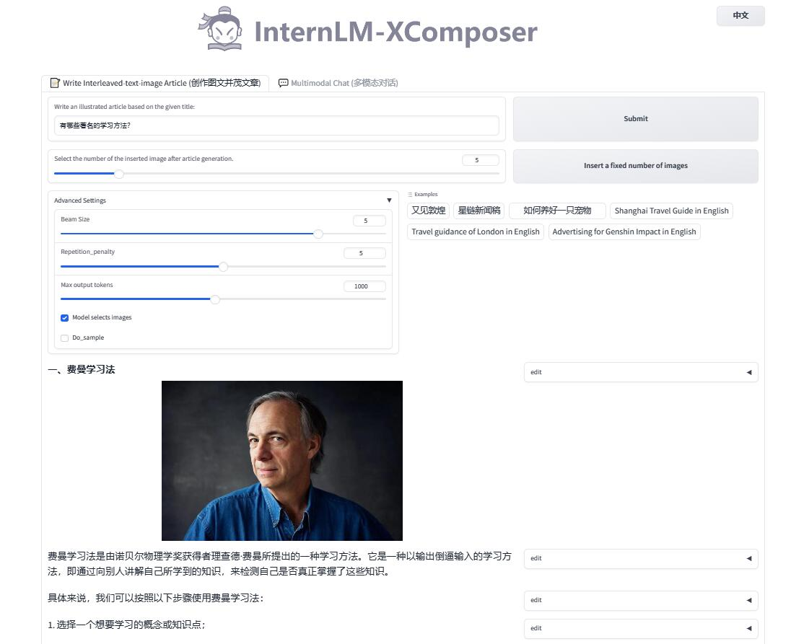
## 3. 图片理解
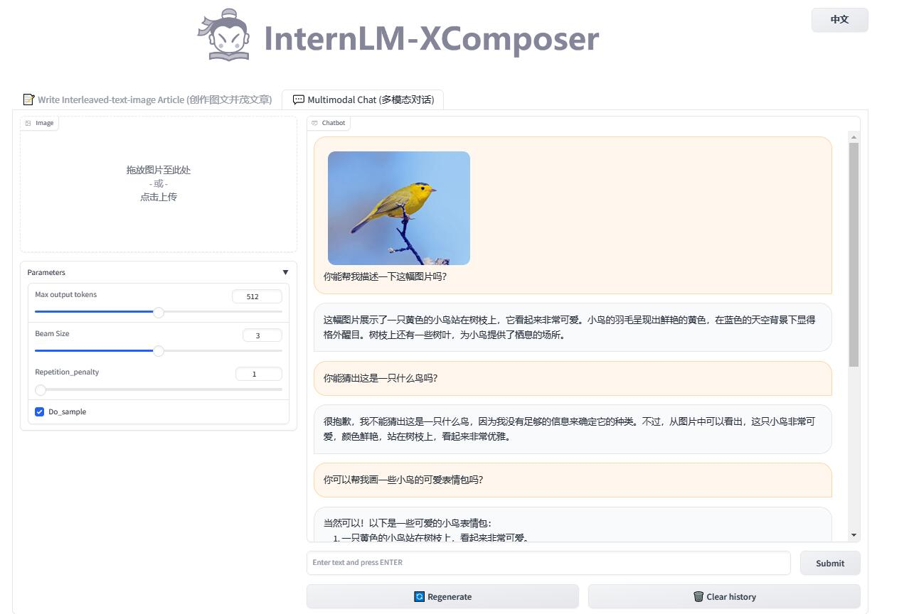

# 完成 Lagent 工具调用 Demo 创作部署（需截图）
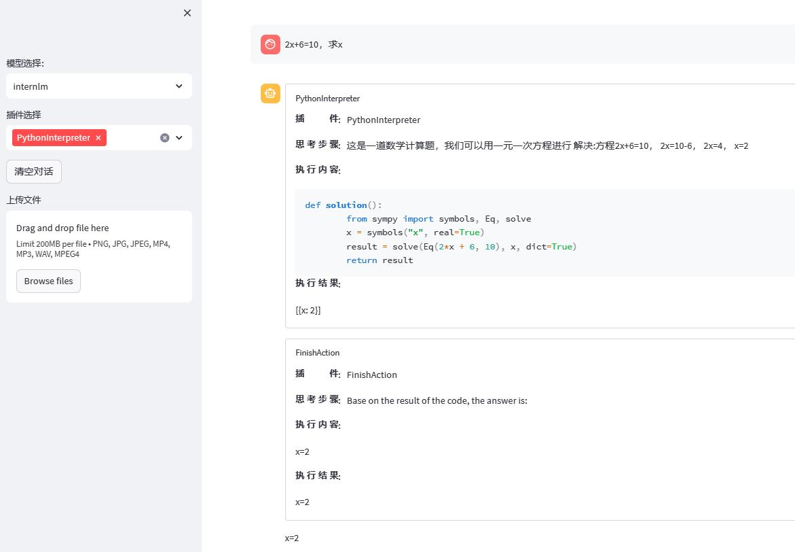