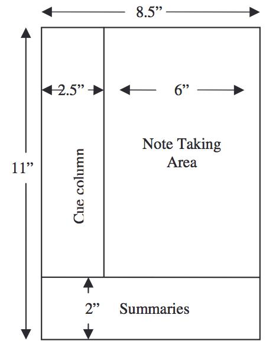
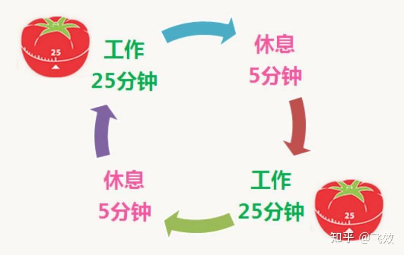

**一、费曼学习法**

  

费曼学习法是由诺贝尔物理学奖获得者理查德·费曼所提出的一种学习方法。它是一种以输出倒逼输入的学习方法，即通过向别人讲解自己所学到的知识，来检测自己是否真正掌握了这些知识。

具体来说，我们可以按照以下步骤使用费曼学习法：

1. 选择一个想要学习的概念或知识点；

2. 将这个概念或知识点用自己的语言解释给别人听；

3. 如果发现自己在解释过程中出现了错误或不清晰的地方，就回到原始材料中重新学习和理解；

4. 不断重复上述步骤，直到自己对该概念或知识点有了深入的理解和掌握。

需要注意的是，在使用费曼学习法时，我们需要注意以下几点：

1. 选择合适的人作为我们的听众；

2. 尽量用简单明了的语言进行解释；

3. 在解释过程中及时纠正自己的错误和不清晰的地方。

总之，费曼学习法是一种非常有效且实用的学习方法，可以帮助我们更好地理解和掌握所学的知识。

**二、康奈尔笔记法**

康奈尔笔记法（Cornell Note-taking System）由约翰·W·康奈尔（John W. Cunningham）于20世纪40年代发明，是一种用于课堂笔记记录和复习的笔记方法。它的核心思想是将笔记分为三个部分：标题栏、内容栏和总结栏。

  

具体来说，我们可以按照以下步骤使用康奈尔笔记法：

1. 在笔记本的一页上写下主题或课程名称；

2. 在另一页上写下主要内容，包括要点、关键词等；

3. 在第三页上写下对内容的简要总结或概括；

4. 在第四页上留出空白区域，用于添加注释、补充说明或其他相关内容。

需要注意的是，在使用康奈尔笔记法时，我们需要注意以下几点：

1. 选择合适的笔记本尺寸和纸张质量；

2. 采用清晰的字体和排版方式；

3. 定期回顾和复习笔记，加深对知识的理解和记忆。

总之，康奈尔笔记法是一种非常实用且有效的笔记方法，可以帮助我们更好地记录和整理课堂笔记，提高学习效率和学习效果。

**三、番茄工作法**

番茄工作法（Pomodoro Technique）是弗朗西斯科·西里洛（Francesco Cirillo）于20世纪80年代发明的一种时间管理方法。其核心思想是将工作时间划分为25分钟的工作时间和5分钟的休息时间，以此来提高工作效率和专注力。

  

具体来说，我们可以按照以下步骤使用番茄工作法：

1. 选择一个需要完成的任务；

2. 设定一个计时器，将其设置为25分钟；

3. 在这25分钟内集中精力完成任务；

4. 当计时器响起时，停止工作并休息5分钟；

5. 重复上述步骤，直到任务完成。

需要注意的是，在使用番茄工作法时，我们需要注意以下几点：

1. 每次只专注于一个任务；

2. 在工作时间内避免干扰和分心；

3. 适当安排休息时间，保证身心健康。

总之，番茄工作法是一种非常简单且实用的时间管理方法，可以帮助我们更好地规划和管理时间，提高工作效率和工作质量。

**四、六顶思考帽**

六顶思考帽（Six Thinking Hats）是美国心理学家爱德华·德博诺（Edward de Bono）提出的思维训练工具，旨在帮助人们从不同的角度看待问题，从而得出更全面、更合理的解决方案。

具体来说，我们可以按照以下步骤使用六顶思考帽：

1. 戴上“白色帽子”，代表客观分析；

2. 戴上“红色帽子”，代表情感表达；

3. 戴上“黑色帽子”，代表批判性思考；

4. 戴上“黄色帽子”，代表乐观主义；

5. 戴上“绿色帽子”，代表创造性思维；

6. 戴上“蓝色帽子”，代表决策和行动。

需要注意的是，在使用六顶思考帽时，我们需要注意以下几点：

1. 每顶帽子都有其特定的作用和意义；

2. 不要同时戴多顶帽子，以免混淆视听；

3. 适时摘下帽子，让大脑得到休息和放松。

总之，六顶思考帽是一种非常有用的思维训练工具，可以帮助我们更好地分析和解决问题，提高创新能力和决策能力。

<TOKENS_UNUSED_1><TOKENS_UNUSED_1><TOKENS_UNUSED_1><TOKENS_UNUSED_1><TOKENS_UNUSED_1><TOKENS_UNUSED_1><TOKENS_UNUSED_1><TOKENS_UNUSED_1><TOKENS_UNUSED_1><TOKENS_UNUSED_1><TOKENS_UNUSED_1><TOKENS_UNUSED_1><TOKENS_UNUSED_1><TOKENS_UNUSED_1><TOKENS_UNUSED_1><TOKENS_UNUSED_1><TOKENS_UNUSED_1>